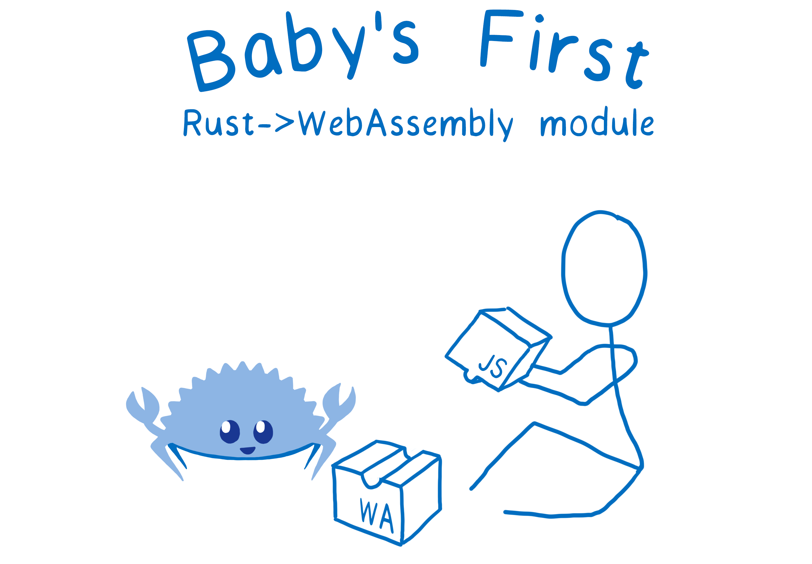

# WebAssembly in the browser

WebAssembly was [originally invented](https://medium.com/wasm/webassembly-on-the-server-side-c584f874b4a3) as a technology solution to speed up code execution inside web browsers. It does not provide a full replacement for JavaScript, but rather works side-by-side with JavaScript. The idea is that JavaScript functions could pass computationally intensive tasks to WebAssembly functions. In this tutorial, we will demonstrate how a simple WebAssembly in-browser application works.


The source code of the tutorial is [here](https://github.com/second-state/wasm-learning/tree/master/browser/hello).


A WebAssembly application typically has two parts.

* The bytecode program that runs inside the WebAssembly virtual machine. This program is compiled from high level languages such as Rust, TypeScript, and Go. So far, Rust provides the most comprehensive tooling support for WebAssembly, and hence it is the most widely used language for WebAssembly modules.
* The host application that provides UI, networking, database, and calls the WebAssembly program to perform key computing tasks or business logic. In the web browser setting, the host is the browser itself.

In this tutorial, the host application is written in JavaScript and runs inside a web browser. The source code of the tutorial is [here](https://github.com/second-state/wasm-learning/blob/master/browser/triple.md). The WebAssembly bytecode program is written in Rust. Now, let’s check out the Rust program. 



> The lightweight WebAssembly virtual machine only supports very limited numeric data types. The host application, on the other hand, probably needs to handle complex data types. One such complex data type is the string. The string is complicated because it contains data of unknown size and of unknown structure \(i.e., encoding\). The host application cannot directly pass string data to and from WebAssembly. It must convert string values to and from numeric values and arrays. You can [read more about it here](https://medium.com/wasm/strings-in-webassembly-wasm-57a05c1ea333).

#### **Setup**

The important development tool we introduce in this tutorial is the `wasm-pack`. It compiles Rust source code into a WebAssembly bytecode program, and then generates a JavaScript module that can interact with the WebAssembly program. The generated code takes care of input / output data encoding and management. This makes it much easier for JavaScript developer to call WebAssembly functions. Follow the steps below to install Rust and the `wasm-pack` tool.

```text
# Install Rust

$ sudo apt-get update
$ sudo apt-get -y upgrade
$ curl --proto '=https' --tlsv1.2 -sSf https://sh.rustup.rs | sh
$ source $HOME/.cargo/env
```

```text
# Install wasm-pack tools

$ curl https://rustwasm.github.io/wasm-pack/installer/init.sh -sSf | sh
```

#### **WebAssembly program in Rust**

In this example, our Rust program appends the input string after “hello”. Let’s create a new `cargo` project. Since this program is intended to be called from a host application, not to run as a stand-alone executable, we will create a `hello` project.

```text
$ cargo new --lib hello
$ cd hello
```

Edit the `Cargo.toml` file to add a `[lib]` section. It tells the compiler where to find the source code for the library and how to generate the bytecode output. We also need to add a dependency of `wasm-bindgen` here. It is the utility `wasm-pack` uses to generate the JavaScript binding for the Rust WebAssembly program.

```text
[lib]
name = "hello_lib"
path = "src/lib.rs"
crate-type =["cdylib"]

[dependencies]
wasm-bindgen = "0.2.50"
```

Below is the content of the Rust program `src/lib.rs`. You can actually define multiple external functions in this library file, and all of them will be available to the host JavaScript app via WebAssembly. The `#[wasm_bindgen]` tag instructs the build tools to generate communication interfaces both in Rust / WebAssembly and in the JavaScript module.

```text
use wasm_bindgen::prelude::*;

#[wasm_bindgen]
pub fn say(s: String) -> String {
  let r = String::from("hello ");
  return r + &s;
}
```

Next, you can compile the Rust source code into WebAssembly bytecode and generate the accompanying JavaScript module.

```text
$ wasm-pack build --target web
```

The results are the following two files. the `.wasm` file is the WebAssembly bytecode program, and the `.js` file is the JavaScript module.

```text
pkg/hello_lib_bg.wasm
pkg/hello_lib.js
```

#### **The JavaScript host**

Let’s switch back to the JavaScript host application. With the generated `hello_lib.js` module, it is very easy to write JavaScript to call WebAssembly functions. After the `import`, the WebAssembly `say()` function now becomes a JavaScript function with the same name. The complete web page source file is [here](https://github.com/second-state/wasm-learning/blob/master/browser/hello/html/index.html).

```text
<script type="module">
  import init, { say } from './hello_lib.js';
  async function run() {
    await init();
    var buttonOne = document.getElementById('buttonOne');
    buttonOne.addEventListener('click', function() {
      var input = $("#nameInput").val();
      alert(say(input));
    }, false);
  }
  run();
</script>
```

The `hello_lib_bg.wasm` program is loaded by the `hello_lib.js` module. Put this HTML file and the `hello_lib.js` and `hello_lib_bg.wasm` files on a web server and you can now access the web page to “say hello” to any name you enter on the page.

#### **What’s next?**

So far, we have seen how to access WebAssembly programs from JavaScript hosted in browsers. But as you know, we believe that WebAssembly’s [real potential is on the server-side](../server-side-webassembly/why/).

