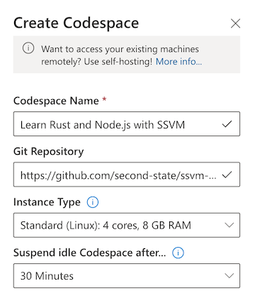
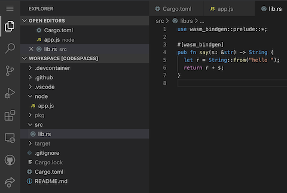
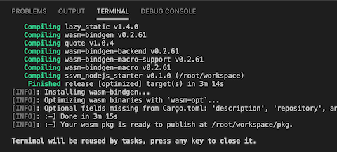
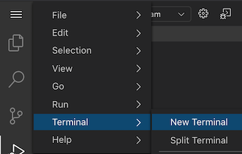
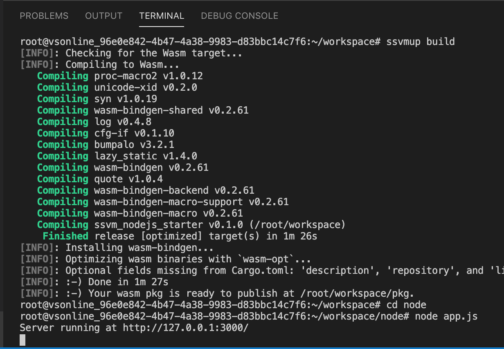

# VSCode codespaces

In the [previous tutorial](./), we discussed how to create a hybrid JavaScript + Rust application for Node.js. In this tutorial, I will show you how to experiment with development without installing any developer tools software.

\*\*\*\*[**Fork this GitHub repository**](https://github.com/second-state/ssvm-nodejs-starter/fork) to get started. In your fork, you can use GitHub's web UI to edit source code files.

* The Rust files are in the `src` directory. You can put high performance workload into Rust functions. The Rust build and dependency configuration is in the `Cargo.toml` file.
* The JavaScript files are in the `node` directory and they can access the Rust functions.
  * The `node/app.js` file contains the application.

### VSCode codespaces steps

First, open the [VSCode Codespaces](https://online.visualstudio.com/) web site and login with your Azure account. You can get a [free Azure account](https://azure.microsoft.com/en-us/free/).

Next, create a new codespace from your forked repository. This step takes a few minutes. But once a codespace is created, subsequent openings only take seconds.



Open the source code files and make changes as you wish!



Click on the Run button on the left panel, and then the Launch Program at the top to build and run the application.


The Terminal window at the bottom shows the build progress. It builds the Rust program, and then launches the Node.js app.



The Debug window shows the Node.js server running and waiting for web requests.


Now, open another terminal window in the IDE via the `Terminal -> New Terminal` menu.



From the terminal window, you can test the local server.

```text
$ curl http://127.0.0.1:3000/?name=SSVM
hello SSVM
```

In fact, you can run any Linux command from VSCode's built-in Terminal. You could run `ssumup build` to build, and then `node node/app.js` to run the Node.js application. The Node.js application could be a server application as we have shown here, or simply a command line program as many of our [later examples](../rust-and-javascript/pass-any-argument-and-return-any-value.md).



That's it! VSCode has many useful features such as real time error detection and syntax highlighting as you type code, advanced Github integration, and integrations with many many development tools. Enjoy coding!

Now continue to see more examples on how to build [complex](../rust-and-javascript/) Rust + JavaScript hybrid applications for cryptography, machine learning, data management, and artificial intelligence.

